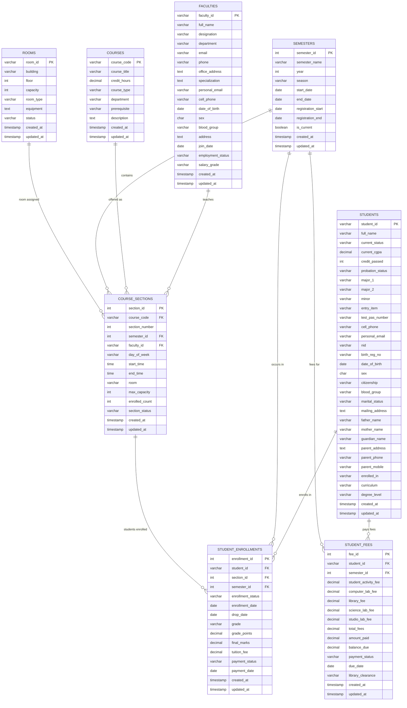

```mermaid
erDiagram
    STUDENTS {
        varchar student_id PK
        varchar full_name
        varchar current_status
        decimal current_cgpa
        int credit_passed
        varchar probation_status
        varchar major_1
        varchar major_2
        varchar minor
        varchar entry_item
        varchar test_pas_number
        varchar cell_phone
        varchar personal_email
        varchar nid
        varchar birth_reg_no
        date date_of_birth
        char sex
        varchar citizenship
        varchar blood_group
        varchar marital_status
        text mailing_address
        varchar father_name
        varchar mother_name
        varchar guardian_name
        text parent_address
        varchar parent_phone
        varchar parent_mobile
        varchar enrolled_in
        varchar curriculum
        varchar degree_level
        timestamp created_at
        timestamp updated_at
    }

    FACULTIES {
        varchar faculty_id PK
        varchar full_name
        varchar designation
        varchar department
        varchar email
        varchar phone
        text office_address
        text specialization
        varchar personal_email
        varchar cell_phone
        date date_of_birth
        char sex
        varchar blood_group
        text address
        date join_date
        varchar employment_status
        varchar salary_grade
        timestamp created_at
        timestamp updated_at
    }

    COURSES {
        varchar course_code PK
        varchar course_title
        decimal credit_hours
        varchar course_type
        varchar department
        varchar prerequisite
        text description
        timestamp created_at
        timestamp updated_at
    }

    SEMESTERS {
        int semester_id PK
        varchar semester_name
        int year
        varchar season
        date start_date
        date end_date
        date registration_start
        date registration_end
        boolean is_current
        timestamp created_at
        timestamp updated_at
    }

    COURSE_SECTIONS {
        int section_id PK
        varchar course_code FK
        int section_number
        int semester_id FK
        varchar faculty_id FK
        varchar day_of_week
        time start_time
        time end_time
        varchar room
        int max_capacity
        int enrolled_count
        varchar section_status
        timestamp created_at
        timestamp updated_at
    }

    STUDENT_ENROLLMENTS {
        int enrollment_id PK
        varchar student_id FK
        int section_id FK
        int semester_id FK
        varchar enrollment_status
        date enrollment_date
        date drop_date
        varchar grade
        decimal grade_points
        decimal final_marks
        decimal tuition_fee
        varchar payment_status
        date payment_date
        timestamp created_at
        timestamp updated_at
    }

    STUDENT_FEES {
        int fee_id PK
        varchar student_id FK
        int semester_id FK
        decimal student_activity_fee
        decimal computer_lab_fee
        decimal library_fee
        decimal science_lab_fee
        decimal studio_lab_fee
        decimal total_fees
        decimal amount_paid
        decimal balance_due
        varchar payment_status
        date due_date
        varchar library_clearance
        timestamp created_at
        timestamp updated_at
    }

    ROOMS {
        varchar room_id PK
        varchar building
        int floor
        int capacity
        varchar room_type
        text equipment
        varchar status
        timestamp created_at
        timestamp updated_at
    }

    %% Relationships
    STUDENTS ||--o{ STUDENT_ENROLLMENTS : "enrolls in"
    STUDENTS ||--o{ STUDENT_FEES : "pays fees"
    
    FACULTIES ||--o{ COURSE_SECTIONS : "teaches"
    
    COURSES ||--o{ COURSE_SECTIONS : "offered as"
    
    SEMESTERS ||--o{ COURSE_SECTIONS : "contains"
    SEMESTERS ||--o{ STUDENT_ENROLLMENTS : "occurs in"
    SEMESTERS ||--o{ STUDENT_FEES : "fees for"
    
    COURSE_SECTIONS ||--o{ STUDENT_ENROLLMENTS : "students enrolled"
    
    ROOMS ||--o{ COURSE_SECTIONS : "room assigned"
```